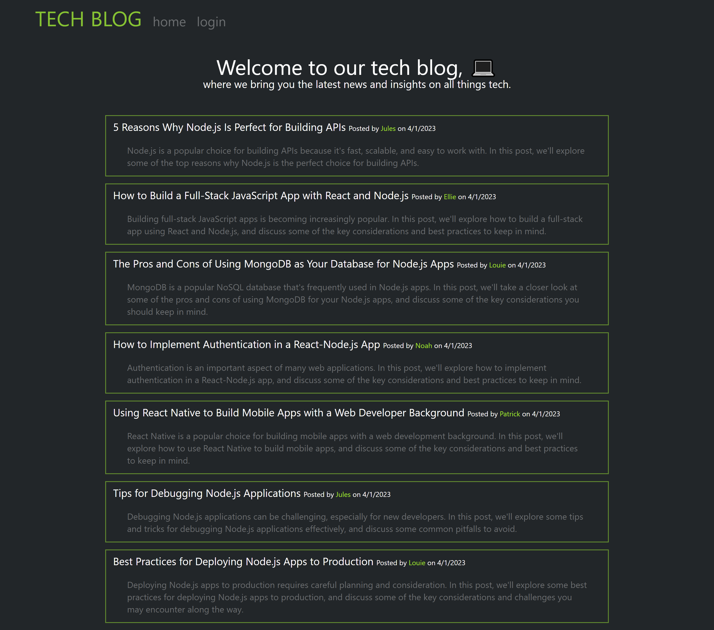
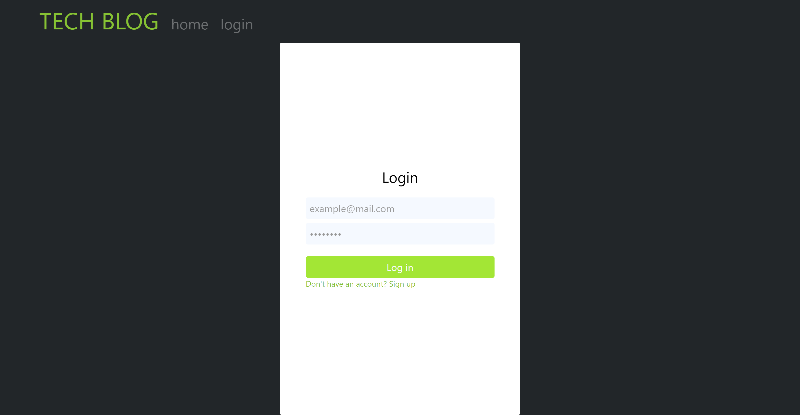
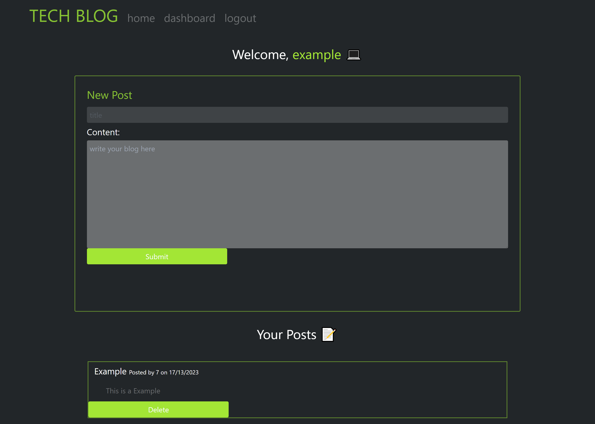

# Tech Blog []

## Description

CMS-style blog site similar to a Wordpress site, where developers can publish their blog posts and comment on other developers’ posts as well.

## URL

https://devblog.herokuapp.com/

## Table of Contents

- [Usage](#usage)
- [License](#license)
- [Questions](#questions)

## Usage

Create an account -> log in -> go to dashboard -> write a post -> you can delete posts on your dashboard as well

## License

[]

## Questions

Github: <andyanza>
Contact: <andrea.anza3@gmail.com>
